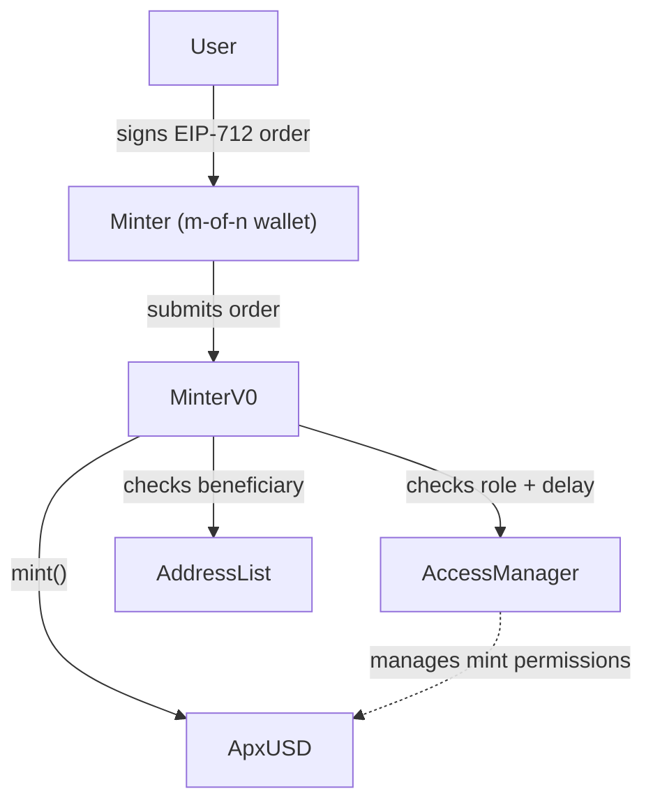
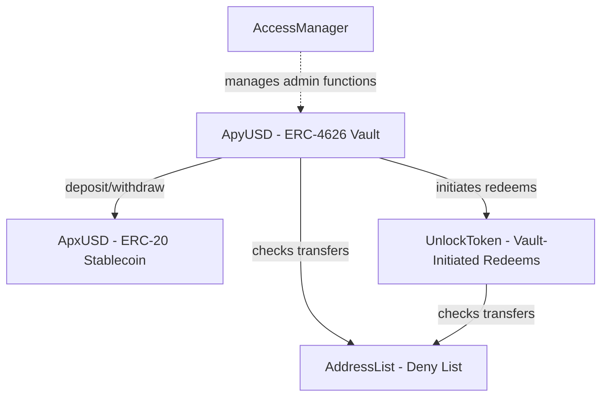
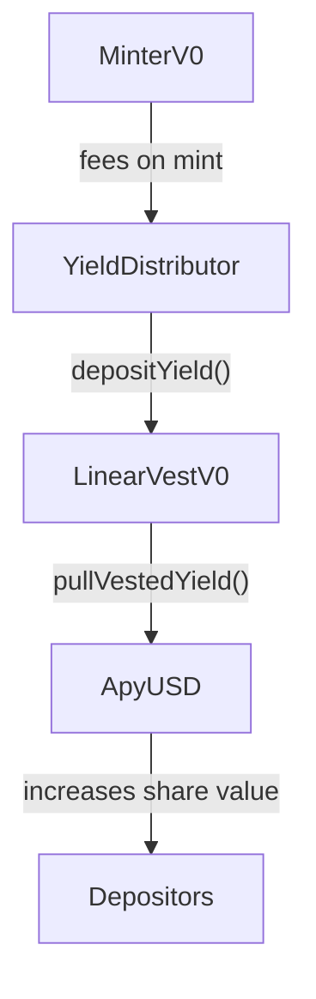
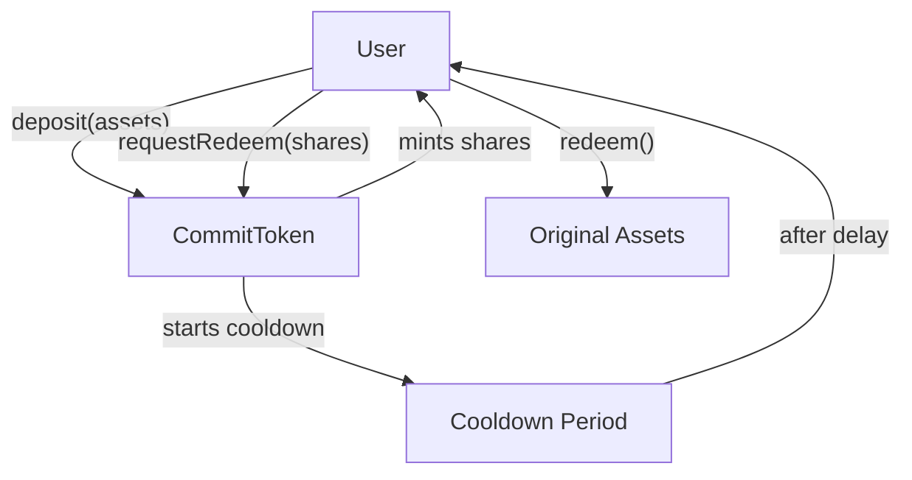

<p align="center">
  <picture>
    <source media="(prefers-color-scheme: dark)" srcset="https://raw.githubusercontent.com/apyx-labs/.github/main/assets/logo-dark.svg" />
    <source media="(prefers-color-scheme: light)" srcset="https://raw.githubusercontent.com/apyx-labs/.github/main/assets/logo-light.svg" />
    
  </picture>
</p>

<p align="center">
  <a href="https://apyx.fi">Website</a>
  · <a href="https://app.apyx.fi">App</a>
  · <a href="https://docs.apyx.fi">Docs</a>
  · <a href="https://apyx-labs.github.io/evm-contracts/">Contract Natspec</a>
</p>

---

Apyx is the first dividend-backed stablecoin protocol, transforming preferred equity issued by Digital Asset Treasuries (DATs) into programmable, high-yield digital dollars. By bundling diversified preferred shares and leveraging protocol functionality, Apyx offers sustained double-digit yield with unprecedented transparency.

**apxUSD** is a synthetic dollar backed by DAT preferred shares, serving as the protocol's primary liquidity layer. **apyUSD** is the yield-bearing savings wrapper, accruing yield from the dividends paid by the underlying collateral.

### Documentation

- [Technical Documentation](https://docs.apyx.fi)
- [How apxUSD Works](https://docs.apyx.fi/apxusd/overview)
- [How apyUSD Works](https://docs.apyx.fi/apyusd/overview)

### Contract Addresses (Ethereum Mainnet)

| Token | Address |
|-------|---------|
| apxUSD | [`0x98A878b1Cd98131B271883B390f68D2c90674665`](https://etherscan.io/address/0x98A878b1Cd98131B271883B390f68D2c90674665) |
| apyUSD | [`0x38EEb52F0771140d10c4E9A9a72349A329Fe8a6A`](https://etherscan.io/address/0x38EEb52F0771140d10c4E9A9a72349A329Fe8a6A) |

---

<p align="center">
  <a href="https://x.com/apyx_fi">X</a> · <a href="https://discord.gg/apyx-fi">Discord</a> · <a href="https://t.me/apyx_announcements">Telegram</a> · <a href="https://github.com/apyx-labs">GitHub</a> · <a href="https://www.reddit.com/r/Apyx/">Reddit</a> · <a href="https://www.linkedin.com/company/apyx-fi">LinkedIn</a>
</p>


## Overview

The Apyx protocol consists of multiple interconnected contracts that enable stablecoin minting, yield distribution, and token locking mechanisms.

| Contract         | Description |
|------------------|-------------|
| **ApxUSD**       | The base ERC-20 stablecoin with supply cap, pause, and freeze functionality. Implements EIP-2612 permit for gasless approvals and uses the UUPS upgradeable pattern. |
| **ApyUSD**       | An ERC-4626 yield-bearing vault that wraps apxUSD, allowing deposits to accrue yield from vesting distributions. |
| **CommitToken**    | An async redeem vault inspired by ERC-7540 with a configurable cooldown period for unlocking. Implements deny list checking and can lock arbitrary ERC-20 tokens for use in off-chain points systems. See [ERC-7540 note](#erc-7540-note) below. |
| **UnlockToken**  | A CommitToken subclass that allows a vault to initiate redeem requests on behalf of users, enabling automated withdrawal flows. See [ERC-7540 note](#erc-7540-note) below. |
| **MinterV0**     | Handles apxUSD minting via EIP-712 signed orders with rate limiting and AccessManager integration for delayed execution. |
| **LinearVestV0** | A linear vesting contract that gradually releases yield to the vault over a configurable period. |
| **YieldDistributor** | Receives minting fees and deposits them to the vesting contract for gradual distribution. |
| **AddressList**  | Provides centralized deny list management for compliance across all Apyx contracts. |

## Architecture

The Apyx protocol consists of several interconnected systems. The following diagrams illustrate the key relationships and flows:

### Minting Flow

A signed EIP-712 order must be submitted by a "Minter" (an m-of-n wallet). The MinterV0 contract validates the order and mints apxUSD after AccessManager delays. The beneficiary must be checked against the AddressList before minting completes.




### Token Relationships

ApyUSD is an ERC-4626 vault that wraps apxUSD for yield-bearing deposits. Withdrawing from ApyUSD transfers the ApxUSD to the UnlockToken. The UnlockToken implements an async redemption flow inspired by ERC-7540. The UnlockToken allows ApyUSD to initiate redeem requests on behalf of users to start the unlocking period.



### Yield Distribution

When the underlying offchain collateral (preferred shares) pay dividends the dividends are minted as apxUSD to YieldDistributor. The YieldDistributor sits between the MinterV0 and the LinearVestV0 to decouple the two contracts and allows a yield operator to trigger deposits into the vesting contract.



### Lock Tokens for Points

CommitToken is a standalone vault that locks any ERC-20 token with a configurable unlocking period. Users deposit tokens to receive non-transferable lock tokens, which can be used for off-chain points systems.




#### ERC-7540 Note

CommitToken and UnlockToken implement a custom async redemption flow inspired by [ERC-7540](https://eips.ethereum.org/EIPS/eip-7540), but are **NOT compliant** with the ERC-7540 specification. They deviate from MUST requirements including: shares not removed from owner on request, preview functions not reverting, operator functionality not supported, and ERC-7575 `share()` method not implemented.

## Installation

This project uses [Foundry](https://book.getfoundry.sh/) and [Soldeer](https://soldeer.xyz/) for dependency management.

```bash
# Clone the repository
git clone <repo-url>
cd evm-contracts

# Install dependencies
forge soldeer install
```

## Development

### Build

```bash
forge build
```

Or using the Justfile:

```bash
just build
```

### Test

Run all tests:

```bash
forge test
```

Run with gas reporting:

```bash
forge test --gas-report
# or
just test-gas
```

Run with verbose output:

```bash
forge test -vvv
```

### Code Coverage

```bash
forge coverage
# or
just coverage
```

### Format Code

```bash
forge fmt
# or
just fmt
```

## Testing

The test suite is organized in the `test/` directory with the following structure:

- **test/contracts/** - Tests organized by contract (ApxUSD, ApyUSD, CommitToken, MinterV0, Vesting, YieldDistributor)
- **test/exts/** - Extension tests (ERC20FreezeableUpgradable)
- **test/mocks/** - Mock contracts for testing
- **test/utils/** - Test utilities (VmExt, Formatter, Errors)
- **test/reports/** - Report (csv) generation tests

Each contract subdirectory contains a `BaseTest.sol` with shared setup and individual test files for specific functionality.

## Dependencies

- [OpenZeppelin Contracts Upgradeable](https://github.com/OpenZeppelin/openzeppelin-contracts-upgradeable) v5.5.0
- [OpenZeppelin Contracts](https://github.com/OpenZeppelin/openzeppelin-contracts) v5.5.0
- [Forge Standard Library](https://github.com/foundry-rs/forge-std) v1.11.0

## Resources

- [Foundry Book](https://book.getfoundry.sh/)
- [OpenZeppelin Docs](https://docs.openzeppelin.com/)
- [EIP-712: Typed structured data hashing and signing](https://eips.ethereum.org/EIPS/eip-712)
- [ERC-2612: Permit Extension for ERC-20](https://eips.ethereum.org/EIPS/eip-2612)
- [ERC-7201: Namespaced Storage Layout](https://eips.ethereum.org/EIPS/eip-7201)
